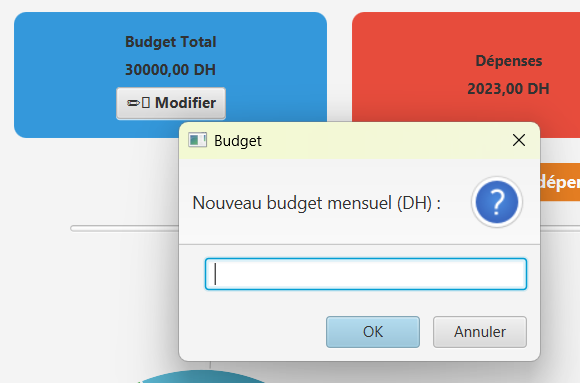
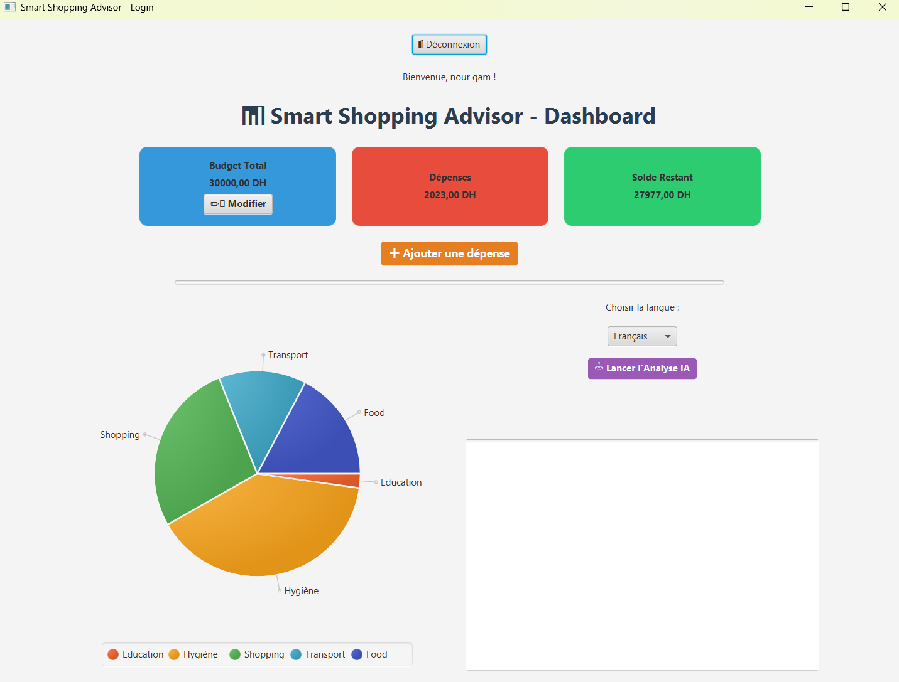
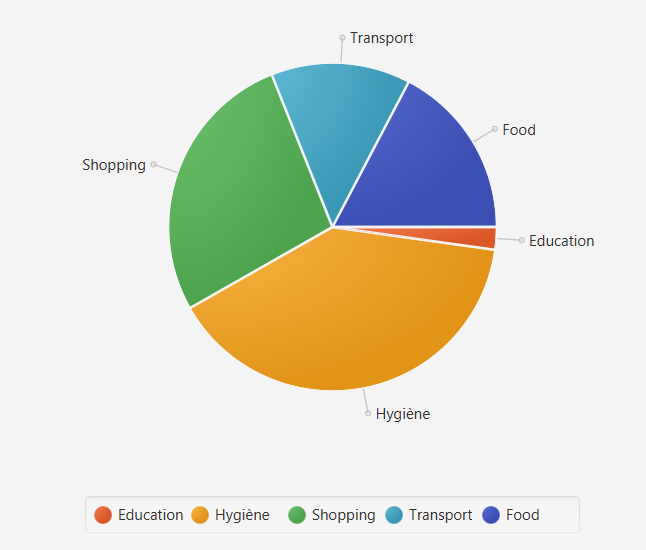
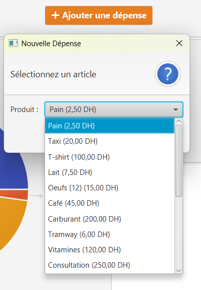
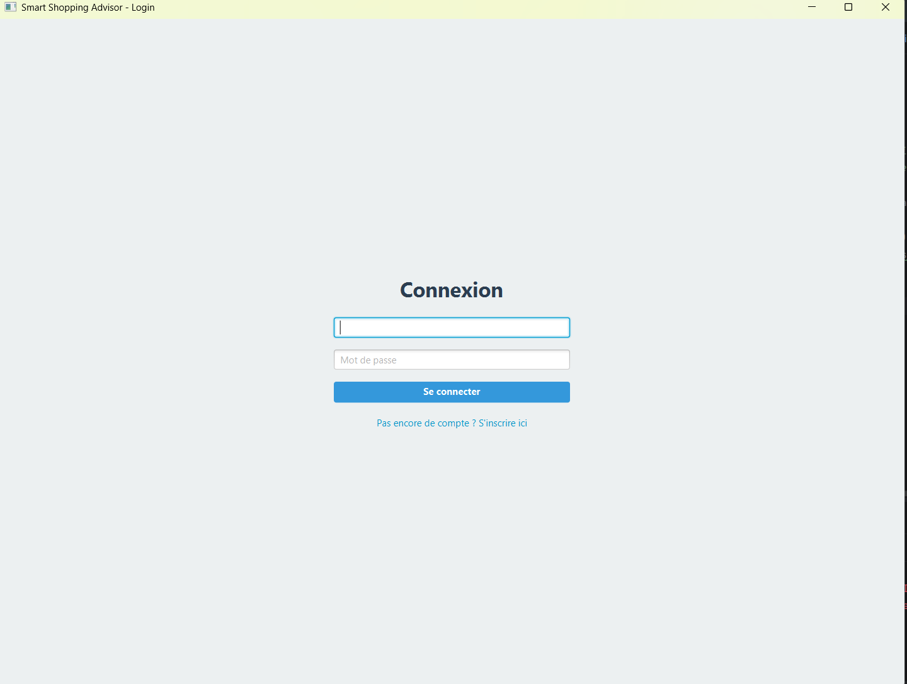
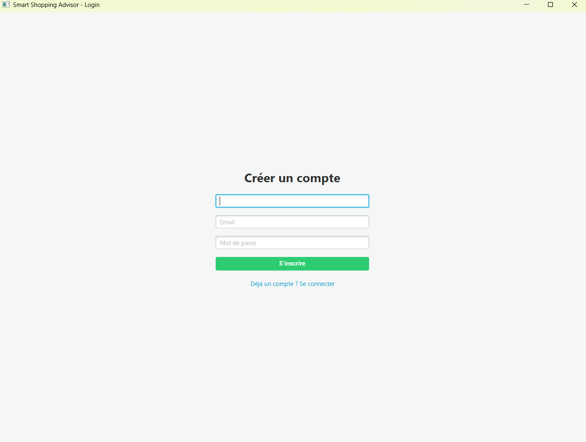

# 📊 Smart Shopping Advisor

## 📌 Description

Smart Shopping Advisor est une application desktop intelligente développée en Java permettant de gérer un budget personnel, suivre les dépenses et recevoir des conseils financiers générés par une intelligence artificielle.

L’application utilise JavaFX pour l’interface graphique et SQL Server pour la gestion des données.

Le système analyse automatiquement les habitudes de consommation et affiche des statistiques interactives.

---

# 🚀 Fonctionnalités

## 🔐 Authentification
- Inscription utilisateur
- Connexion sécurisée
- Gestion de session

## 💰 Gestion du Budget
- Définition du budget mensuel
- Modification du budget
- Calcul automatique des dépenses

## 🛒 Gestion des Dépenses
- Ajout des dépenses
- Organisation par catégories
- Suivi des achats

## 📊 Tableau de Bord
- Budget total
- Dépenses totales
- Solde restant
- Diagramme circulaire des dépenses
- Barre de progression du budget

## 🤖 Intelligence Artificielle
Le projet intègre une IA locale avec Ollama et Llama 3 afin de :
- analyser les dépenses,
- donner des conseils financiers,
- proposer des recommandations personnalisées.

Langues supportées :
- Français
- English
- العربية
- Darija

---

# 🛠️ Technologies Utilisées

| Technologie | Rôle |
|---|---|
| Java 17 | Développement principal |
| JavaFX | Interface graphique |
| Maven | Gestion des dépendances |
| SQL Server | Base de données |
| JDBC | Connexion base de données |
| Ollama | IA locale |
| Llama 3 | Modèle IA |
| JSON | Communication API |

---

# 🗄️ Base de Données

Le projet utilise SQL Server avec les tables suivantes :
- users
- budgets
- expenses
- products
- categories

---

# ⚙️ Installation

## 1️⃣ Cloner le projet

```bash
git clone https://github.com/NourElHoudaGamran/SmartShoppingAdvisor.git
2️⃣ Créer la base de données

Créer la base :

CREATE DATABASE SmartShoppingDB;

Puis exécuter le fichier :

database.sql
3️⃣ Configurer la connexion SQL Server

Modifier le fichier :

DBConnection.java

Et remplacer :

private static final String USER = "YOUR_USERNAME";
private static final String PASSWORD = "YOUR_PASSWORD";
4️⃣ Installer Ollama

Télécharger :
https://ollama.com/download

Puis installer le modèle :

ollama run llama3
5️⃣ Lancer le projet
mvn javafx:run
📁 Structure du Projet
src/
 ├── App
 ├── dao
 ├── model
 ├── service
 └── database
📷 Captures d’écran

Ajouter ici :

écran de connexion
dashboard
graphiques
analyse IA
📚 UML

Le projet contient :

Diagramme de classes
Diagramme de cas d’utilisation
Modèle relationnel
👨‍💻 Auteur

# 📷 Captures d’écran

## 💰 Gestion du Budget


## 📊 Dashboard


## 🥧 Analyse des Dépenses


## 💸 Gestion des Dépenses


## 🔐 Login


## 📝 Sign Up



Développé par Gamran Nour El Houda

🌟 Points Forts

✅ Interface moderne JavaFX
✅ Architecture DAO / Service / Model
✅ Intégration IA réelle
✅ Analyse financière intelligente
✅ Gestion complète de base de données
✅ Projet évolutif